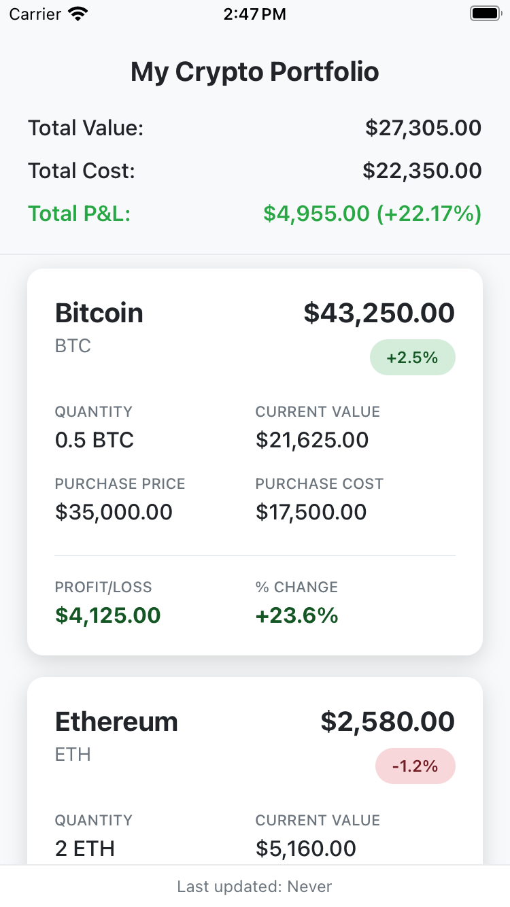

# Crypto Portfolio App

A React Native mobile application for tracking cryptocurrency investments with real-time portfolio management and performance analytics.





## Technology Stack

- **React Native**: Cross-platform mobile development framework
- **Expo**: Development platform and build tools
- **TypeScript**: Type-safe JavaScript development
- **Zustand**: Lightweight state management

## Prerequisites

Before you begin, ensure you have the following installed:

- **Node.js** (version 16 or higher)
- **npm** or **yarn** package manager
- **Expo CLI** (`npm install -g @expo/cli`)
- **iOS Simulator** (for iOS development) or **Android Studio** (for Android development)

## Installation

1. **Clone the repository**
   ```bash
   git clone <repository-url>
   cd CryptoPortfolio
   ```

2. **Install dependencies**
   ```bash
   npm install
   ```

3. **Start the development server**
   ```bash
   npm start
   ```

4. **Run on your preferred platform**
   ```bash
   # For iOS
   npm run ios
   
   # For Android
   npm run android
   ```

## Testing

   ```bash
   npm test
   ```

